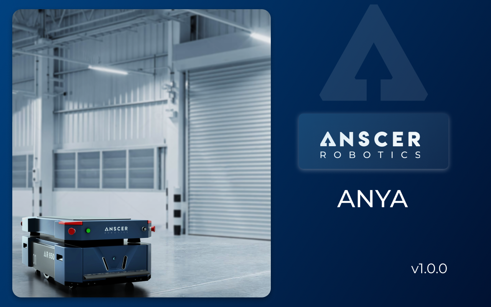

# Introduction

ANSCER ANYA is a software solution designed to manage and automate material transport in warehouses and industries for ANSCER ROBOTS. This is designed to provide organizations/individuals with full visibility and control over their ANSCER ROBOTS, enabling them to streamline their material transport operations, reduce manual labor, and improve overall efficiency. The solution is highly scalable and customizable, allowing organizations to tailor it to their specific needs. With ANSCER ANYA, organizations can optimize their material transport processes and maximize the productivity of their ANSCER ROBOTS.
